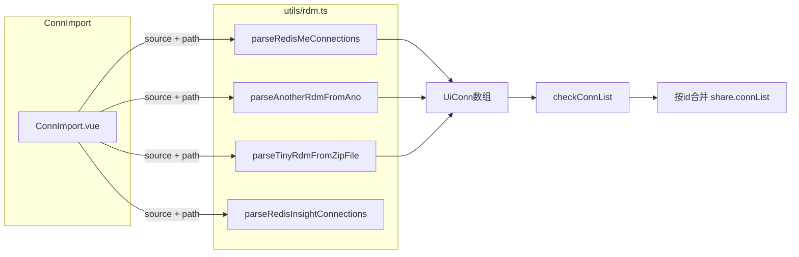

# RDM 连接导入

> **实现状态**：✅ 已实现  
> **关键代码**：`src/utils/rdm.ts`、`src/views/conn/ConnImport.vue`、`src/views/AppMain.vue`  
> **实际实现**：支持 RedisME / AnotherRDM / TinyRDM / Redis Insight 四来源；`AppMain` provide 导入入口（TabConn / 快捷键均可触发）。

从 RedisME、AnotherRDM、TinyRDM、Redis Insight 导出文件导入连接；解析与映射集中在 [`src/utils/rdm.ts`](../src/utils/rdm.ts)（后续更多 RDM 在同一文件扩展）。

## plans 目录命名规范

见 [README.md](./README.md)。已实现方案使用 `01_`～`NN_` 前缀；本文件为 **04_rdm-import.md**。

---

## 现状

- 导入入口：`AppMain.vue` provide → `TabConn` 快捷键 / 菜单打开 `ConnImport` 对话框。
- 解析与映射：`src/utils/rdm.ts`；UI：`src/views/conn/ConnImport.vue`。
- 合并：`checkConnList` → 按 `id` 写入 `share.connList`。

## 外部格式结论

| 来源              | 文件    | 内容                                                                        |
| ----------------- | ------- | --------------------------------------------------------------------------- |
| **AnotherRDM**    | `.ano`  | Base64(UTF-8 JSON 数组) → `parseAnotherRdmFromAno`                          |
| **TinyRDM**       | `.zip`  | zip 内 `connections.yaml` → `parseTinyRdmFromZipFile`                       |
| **RedisME**       | `.mec`  | Base64(UTF-8 JSON 数组) → `parseRedisMeConnections`；兼容明文 `[` 开头 JSON |
| **Redis Insight** | `.json` | JSON → `parseRedisInsightConnections`                                       |

## 架构（数据流）

## 实现要点

### 1. MeFileInput 与文件类型

**不修改** `MeFileInput.vue`。在 `ConnImport` 中按来源绑定后缀：`mec` / `ano` / `zip` / `json`（Insight）。

### 2. 新建 `src/utils/rdm.ts`

**命名**：各类 RDM 连接导入转换集中在此文件，避免碎片化。

- **RedisME**：从现有 `checkImportContent` 抽出「JSON → 校验 → `UiConn[]`」为纯函数，或复用相同校验逻辑。
- **AnotherRDM**：`trim` → Base64 → UTF-8 解码（`Uint8Array` + `TextDecoder`）→ `JSON.parse` → 映射到 `UiConn`：
  - `id`：`another-${item.key}`，缺 `key` 时用 `nanoid()`。
  - `name`、`host`、`port`（转 `number`、限制 `u16`）、`password`←`auth`、`username`、`cluster`、`readonly`←`connectionReadOnly`、`color`。
  - SSH / SSL / Sentinel 按字段映射到 `ConnConfig`（`privatekey`→`pkfile`；`nodePassword`→`sentinelOption.masterPassword` 等）。
  - `db`：无则 `0`。
- **TinyRDM**：`readFile` 读 zip → `fflate.unzipSync` → 查找 `connections.yaml` 或 `*/connections.yaml` → `yaml` 解析 → 递归展平 group → 映射到 `UiConn`。
  - **Unix 套接字**：后端仅 TCP 时跳过并提示。
  - `id`：建议 `tinyrdm-${name}` 等确定性前缀。

调用方对结果数组执行 [`checkConnList`](../src/plugins/tauri.ts)，再按 `id` 与 `share.connList` 合并。

### 3. UI

- 新增 [`src/views/conn/ConnImport.vue`](../src/views/conn/ConnImport.vue)（与 `ConnSave.vue` 并列）。
- [`TabConn.vue`](../src/views/TabConn.vue)：下拉「导入」改为打开对话框。

### 4. 依赖

`vp add yaml fflate`

### 5. i18n

[`zh-cn.ts`](../src/locales/lang/zh-cn.ts)、[`en.ts`](../src/locales/lang/en.ts) 的 `conn` 段：对话框标题、三来源、文件必填、各解析错误文案等。

### 6. 验证

手工验证 `.ano` / `.zip`；`vp check`、按需 `vp test`、`pnpm run check-locale-keys`。

## 风险与范围控制

- 证书/私钥路径跨机可能无效，属预期。
- `tauri-specta.ts` 若由工具链再生成，按仓库惯例处理差分。

---

## 实现清单

- [x] `vp add yaml fflate`（依赖：`fflate`、`yaml`）
- [x] 新增 `src/utils/rdm.ts`（RedisME / AnotherRDM / TinyRDM / Redis Insight）
- [x] 新增 `ConnImport.vue`；`AppMain` / `TabConn` 接入
- [x] 中英 `conn.*` 文案；`vp check` + `check-locale-keys`；Tauri `fs:allow-read-file`
