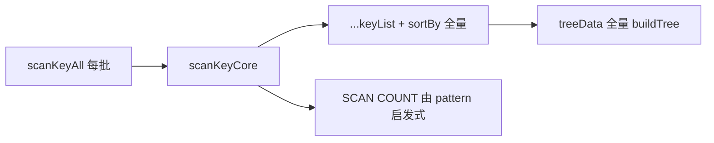

# 键扫描全量加载性能优化

> **实现状态**：已实现  
> **关联 issue**：[#141](https://github.com/hepengju/redis-me/issues/141)（全量约 500 万 key 慢、占内存大）  
> **前置**：[06_scan-keys-optimization.md](./06_scan-keys-optimization.md)（暂停/继续/取消、边扫边显示已落地）  
> **关键代码**：[KeyMain.vue](../src/views/KeyMain.vue)、[KeyTree.vue](../src/views/key/KeyTree.vue)、[impl_single.rs](../src-tauri/src/client/impl_single.rs) / [impl_cluster.rs](../src-tauri/src/client/impl_cluster.rs)、[client_trait.rs](../src-tauri/src/client/client_trait.rs) `scan_0_batch_count`、[model.rs](../src-tauri/src/utils/model.rs) `ScanParam`

## 目标

在**不改变** `RedisKey { key, bytes }` 双字段与树节点包装的前提下，降低「加载全部」时的 CPU / 卡顿与 IPC 轮次，界面上仍感觉在实时增长。

## 已确认决策

| 项                       | 结论                                                                                                          |
| ------------------------ | ------------------------------------------------------------------------------------------------------------- |
| Redis `SCAN COUNT`       | **直接取设置 `keyScanCount`**，去掉「去 `*` 后 ≤1 字符 → 1000，否则 10000」                                   |
| `keyScanCount` 上限      | **`10–10000` → `10–50000`**（更大 COUNT 减少 IPC 轮次；提示文案说明过大可能单次更卡）                         |
| 列表追加                 | **原始数组 `push` 追加**，扫描过程中**不做** `[...old, ...new]` + 全量 `sortBy`                               |
| 扫描中建树               | **保持现有树/列表模式**（用户边扫边看树）；靠 100ms 节流减少重建次数即可，**不做**「扫描中改列表 / 延后建树」 |
| 双字段 / 树节点包装      | **不变**                                                                                                      |
| 可见行 `TYPE` 抖动       | **不管**                                                                                                      |
| UI 刷新                  | loadAll（及高强度续扫）**按固定间隔写回**界面，间隔取用户几乎无感、看起来仍在实时变化的值                     |
| 后端单次 invoke 多轮凑批 | **本方案不做**                                                                                                |
| payload 瘦身             | **本方案不做**                                                                                                |

---

## 现状问题（本方案要动的）



1. **每批** `[...keyList, ...new]` 再 `sortBy`：拷贝 + \(O(n \log n)\)，loadAll 下随已加载量恶化。
2. **每批立刻**写 `keyList` → `KeyTree.treeData` 全量 `buildTree`（同层 `find`）+ `countLeaves` + 排序。
3. **COUNT 与设置脱节**：`keyScanCount` 只做前端自动续扫阈值；后端 `scan_0_batch_count` 按 pattern 写死 1000/10000；进度估算用前端 `computeScanBatchSize`，三者语义不一致。设置文案已像 COUNT，实现却不是。

---

## 方案

### 1. `keyScanCount` → 后端 SCAN COUNT

对齐字段扫描：`fieldScanCount` 经 `FieldScanParam.count` 传到后端。

**后端**

- `ScanParam` 增加 `count: u64`（与 `FieldScanParam` 一致）。
- `impl_single` / `impl_cluster` 的 `fn scan`：`batch_count = param.count`（`0` 时兜底 `1000`）。
- **删除**（或不再调用）`scan_0_batch_count` 的 pattern 启发式。
- 测试 / `ScanParam::all` 等补默认 `count`。

**前端**

```ts
// KeyMain scanKeyCore
const params = {
  match: match.value,
  type: keyType.value === 'ALL' ? '' : keyType.value.toLowerCase(),
  cursor: cursor.value,
  exact: exact.value && !loadFolder.value,
  count: meTauri.settings.keyScanCount as number, // Redis SCAN COUNT hint
}
```

- `SCAN_FETCH_COUNT`（自动续扫凑满一页）**继续**用同一 `keyScanCount`（与 `fieldScanCount` 一值两用一致：COUNT hint + 自动停扫阈值）。
- 进度环：`scanBatchSize` 改为读 `keyScanCount`，不再用 `computeScanBatchSize(match)`。
- `computeScanBatchSize`：删除，或改为薄封装读设置（避免残留启发式）。
- 设置文案改为明确：**Redis SCAN 的 COUNT（提示值）**；过大增加单次阻塞、过小增加往返。
- 设置范围：`Setting.vue` / `MORE_SETTING_LIMITS.keyScanCount` 的 **max 改为 `50000`**（min 仍为 `10`）；i18n tip 中的 `{max}` 随之更新。

### 2. 原始数组追加，扫描中不排序

当前：

```ts
const newKeyList = useCursor ? [...keyList.value, ...data.keyList] : data.keyList
keyList.value = sortBy(newKeyList, ['key'])
```

改为：

- 扫描进行中维护**普通工作数组** `scanBuffer`（非响应式，或仅底层存储）。
- 每批：`for (const k of data.keyList) scanBuffer.push(k)`（避免每批 spread 出新大数组）。
- **扫描过程中不调用 `sortBy`**。
- 新搜索（`useCursor=false`）：`scanBuffer = data.keyList`（或清空再 push）。
- 扫描**结束**（含暂停 / `cursor.finished` / 自动停扫）：再 **一次** `sortBy`（或原地按 `key` 排序）后写回，保证列表有序，便于立刻定位。
  - 续扫会继续 `push`；下次结束再排一次。
  - 树模式：`treeData` 内已有节点排序，最终一次全量排序对树影响次要，仍做一次以保持 `keyList` 有序（定位/导出等）。

说明：SCAN 返回顺序本就不是字典序；扫描过程中为追加序，**每次扫描会话结束（含暂停）**再排序。用户暂停通常已大致找到目标，需要有序列表。

### 3. 节流写回 UI（看起来仍实时）

**策略**：脏标记 + **固定间隔 flush**，不按「每 N 批」。

| 参数               | 取值    | 理由                                                                     |
| ------------------ | ------- | ------------------------------------------------------------------------ |
| `SCAN_UI_FLUSH_MS` | **100** | 约 10 次/秒刷新；人眼仍觉连续增长；本地 Redis 每批很快时，避免每批重建树 |

实现要点：

1. 每批只 `push` 到 `scanBuffer`，设 `scanDirty = true`，**不**立刻赋 `keyList`。
2. 扫描开始时启动 `setInterval`（或 `setTimeout` 链）每 100ms：若 `scanDirty`，则
   - `keyList.value = scanBuffer.slice()`（每 100ms 一次浅拷贝，保证新数组引用，KeyTree 才能重建）。
   - 清 `scanDirty`。
   - 勿直接 `keyList = scanBuffer` 同引用：子组件 prop 引用不变时树不会更新。
3. 扫描结束 / 取消 / 暂停 / `finally`：再 flush 一次并**排序**，清定时器。
4. 进度环、`scanBatchCount`、cursor 状态仍可每批更新（轻量），与键列表刷新解耦。

**适用路径**：`loadAll=true` 必开；`scanKeyAuto` 若多轮很快也可共用同一缓冲+flush，避免搜索自动续扫时同样卡顿。单次「加载更多」一轮也可走缓冲，逻辑统一更简单。

观感：100ms 内列表与计数仍持续变，用户几乎感觉不到「一卡一卡」；比每批重建树轻一个数量级以上（本地高吞吐时尤其明显）。

### 4. `buildTree` 同层改 Map

[KeyTree.vue](../src/views/key/KeyTree.vue) 现：

```ts
let node = nowLevel.find(item => item.label === part && item.redisKey === undefined)
```

改为每层 `Map<string, KeyBuildNode>`（仅文件夹节点）O(1) 查找；叶子仍 `push`。`countLeaves` / 排序逻辑不变。

即使有 UI 节流，flush 时仍可能对百万级全量建树，Map 降低同前缀宽扇出时的 CPU。扫描中仍走完整 `treeData`（含 `countLeaves` / 排序），保证树模式边扫边可用。

---

## 不改动

- `RedisKey` / `ui_key_list` / Base64 `bytes`
- 树节点 `{ id, label, children, redisKey, keyCount }` 结构
- 扫描中弱化建树（强制列表 / 结束后再建树 / 跳过中间 `countLeaves`）
- `KeyTypeTag` 可见行按需 TYPE
- 暂停 / 继续 / 取消语义
- 后端「单次 invoke 只跑一轮 SCAN」（仍由前端 `scanKeyAll` 递归）

---

## 涉及文件（预计）

| 文件                                                      | 改动                                                  |
| --------------------------------------------------------- | ----------------------------------------------------- |
| `src-tauri/src/utils/model.rs`                            | `ScanParam` 加 `count`                                |
| `src-tauri/src/client/impl_single.rs` / `impl_cluster.rs` | 用 `param.count`                                      |
| `src-tauri/src/client/client_trait.rs`                    | 去掉/停用 `scan_0_batch_count` 启发式                 |
| `src-tauri/src/client/mod.rs` 等测试                      | 补 `count`                                            |
| `src/views/KeyMain.vue`                                   | 传 `count`；`scanBuffer` + push；节流 flush；结束排序 |
| `src/utils/redis-glob.ts`                                 | 进度不再用 pattern 启发式 COUNT                       |
| `src/views/key/KeyTree.vue`                               | `buildTree` Map                                       |
| `src/views/ext/Setting.vue`                               | `keyScanCount` max → `50000`                          |
| `src/locales/lang/zh-cn.ts` / `en.ts`                     | `keyScanCountTip` 文案对齐 COUNT（含新上限）          |
| specta 类型                                               | 重新生成或手改 `ScanParam`                            |

---

## 验收

- 设置 `keyScanCount=1000/50000` 时，Redis 侧 SCAN 的 COUNT 与之一致（可用命令日志核对）；设置项上限为 50000。
- 「加载全部」过程中列表/树约每 100ms 增长，树模式仍可展开浏览；结束后列表有序。
- 暂停 / 继续 / 取消后列表与 cursor 正确。
- 树模式 / 列表模式、精确匹配、集群扫描结果与改前一致（顺序扫描中可不字典序，结束后一致）。
- 同库全量：耗时与主线程卡顿相对改前有体感改善（不必追平 RDM）。

## 实现顺序建议

1. `ScanParam.count` + 后端改用 `keyScanCount` + 上限 50000 + 文案 / 进度估算对齐
2. `scanBuffer` push + 结束排序 + 100ms flush
3. `buildTree` Map

（1 可独立合入；2+3 对 #141 卡顿收益最大。）
