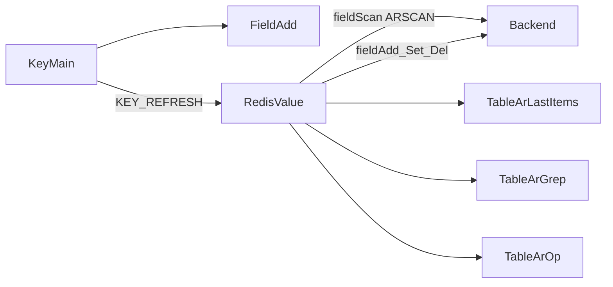

# 18. Redis 8.8 Array 类型支持

> **实现状态**：18.1 / 18.2 已提交；18.3 待做

> **关联 backlog**：`docs/zh/changelog/future.md`（Future 首条）  
> **关键代码**：`src-tauri/src/client/client_trait.rs`、`src-tauri/src/utils/util.rs`、`src/utils/util.ts`、`src/views/tab/RedisValue.vue`、`src/views/ext/FieldAdd.vue`、`src/views/ext/FieldSet.vue`、`src/views/KeyMain.vue`

> 目标：按现有「统一 fieldScan + RedisValue 分支」支持 Redis 8.8 Array（稀疏索引数组），并对标 List 索引范围、ZSet TopN、Hash 扫描等设计专用操作。分阶段验收与提交。

---

## 一、决策摘要（已定）

| 项       | 结论                                                                                                                    |
| -------- | ----------------------------------------------------------------------------------------------------------------------- |
| 计划位置 | 本文件 `plans/18_array-type-support.md`                                                                                 |
| 能力探测 | **不做**；服务端不支持时新建/读写走现有报错即可                                                                         |
| Tag 简称 | Array = `A`；扫描类型「ALL」按钮简称由默认 `A` 改为 `-`（避免与 Array 重复）                                            |
| Tag 颜色 | 与 JSON / Stream 相同：`type: 'warning'`（`KeyTypeTag` 走 `meType`）                                                    |
| redis-rs | 当前无正式 `ValueType::Array`，统一按 `Unknown("array")` 处理；**关键分支加注释**，防日后升级库后变体变化导致静默漏匹配 |
| 交付节奏 | 18.1 → 18.2 → 18.3，每阶段验收通过后单独 commit                                                                         |

---

## 二、类型语义（与现有对照）

| 维度 | Array                                         | 最接近对照                                                      |
| ---- | --------------------------------------------- | --------------------------------------------------------------- |
| 寻址 | 稀疏整数索引，空洞不占位                      | List 稠密下标；Hash 字段名                                      |
| 长度 | **ARLEN**=maxIndex+1；**ARCOUNT**=已填充数    | List 仅 LLEN                                                    |
| 浏览 | **ARSCAN** 只返回已填充槽（默认）             | Hash HSCAN；**勿默认 ARGETRANGE**（空洞回 nil，稀疏大区间危险） |
| 读写 | ARSET/ARMSET、ARGET/ARMGET、ARDEL             | Hash HSET/HGET/HDEL                                             |
| 追加 | ARINSERT / ARSEEK / ARNEXT；环形 ARRING       | List LPUSH/RPUSH                                                |
| 特有 | ARLASTITEMS、ARGREP、AROP、ARINFO、ARDELRANGE | ZSet TopN / Rank                                                |
| POP  | 无                                            | 不做 field_pop；删槽用 ARDEL                                    |

`TYPE` 返回 `array`。命令一律 `redis::cmd("AR…")` 原始调用。



---

## 三、redis-rs `Unknown("array")` 约定

当前依赖无 `ValueType::Array`。实现时：

1. 用辅助判断集中处理，例如 `fn is_array_type(t: &ValueType) -> bool`，内部匹配 `ValueType::Unknown(s) if s.eq_ignore_ascii_case("array")`。
2. **所有**读/写/长度/复制命令分支通过该辅助函数进入 Array 逻辑，避免散落魔法字符串。
3. 在辅助函数与关键 `match` 处加中文注释，说明：
   - 为何用 `Unknown("array")`
   - 升级 redis-rs 若出现正式 `ValueType::Array`（或字符串大小写变化），必须同步改此判断，否则会落入 `KeyTypeUnknown` / 静默走错分支
4. 前端 UI 类型名与 JSON 类似：展示/列表用 `ARRAY`，与后端 `ui_key_type` 对齐（小写 `array` ↔ 大写 `ARRAY` 按现有 `string`/`STRING` 惯例）。

---

## 四、UI 形态

### 4.1 类型注册

[`KEY_TYPE_LIST`](../src/utils/util.ts)：

```ts
{ short: 'A', value: 'ARRAY', type: 'warning' } // 与 JSON / Stream 同色
```

[`KeyMain.vue`](../src/views/KeyMain.vue) 扫描类型「ALL」两处都要改，避免与 Array 的 `A` 冲突：

1. 按钮展示：`meKeyShort(keyType, '-')`（现状默认 `'A'`）
2. 下拉项内硬编码的 `<el-tag>A</el-tag>` → `-`

下拉完整文案仍为 `ALL`；仅简称 Tag 改为 `-`。

### 4.2 详情页

- 表格列：**index / value**（不展示空槽）
- Header：同时展示 `ARCOUNT`（元素数）与 `ARLEN`（逻辑长度）
- 纳入 `supportsTableView`；精确查索引 → `ARGET`
- 新建/插行 [`FieldAdd.vue`](../src/views/ext/FieldAdd.vue)：指定索引 `ARSET`；18.2 再加 `ARINSERT`
- 编辑 [`FieldSet.vue`](../src/views/ext/FieldSet.vue)：改 value，索引只读
- 值编码、复制为命令：对齐 Hash 字段路径

### 4.3 特有操作

| Array 能力                 | 对标                   | 形态                                                | 阶段      |
| -------------------------- | ---------------------- | --------------------------------------------------- | --------- |
| 索引范围 + ARSCAN 分页     | List 索引范围          | 工具栏区间；`LIMIT=batch`，下页 `start=lastIndex+1` | 18.2      |
| ARLASTITEMS `[REV]`        | ZSet TopN              | 弹框（仿 `TableZsetRange.vue`）                     | 18.2      |
| ARGREP                     | Hash 精确 + 更强过滤   | 弹框：谓词 + 范围                                   | 18.3      |
| AROP / ARINFO / ARDELRANGE | 聚合 / 元信息 / 批量删 | 弹框或确认操作                                      | 18.3      |
| ARRING                     | 环形缓冲               | 可选后置                                            | 18.3 可选 |

---

## 五、分阶段验收与提交

每阶段：**实现 → 手工验收 → 单独 commit**（一行标题，无 body）。`future.md` 可在对应阶段勾选或完成后移入「已完成」。

### 18.1 基础读写（P0）— 第 1 次提交

**做：**

- 后端：`is_array_type` + 注释；`field_scan`（ARSCAN）、`field_get`（ARGET）、`field_add`/`field_set`（ARSET）、`field_del`（ARDEL）、length（ARCOUNT + ARLEN）、`get_*_as_command`
- 前端：`KEY_TYPE_LIST` 增加 ARRAY；ALL 简称改为 `-`；`RedisValue` 表格；`FieldAdd`/`FieldSet` 基础；i18n
- **不做** capabilities / 版本隐藏

**验收：**

- Redis ≥ 8.8：新建 Array、浏览、改值、删行、复制命令正常
- 旧版 Redis：新建 Array 命令失败，错误提示可理解（与现有其他不支持命令一致）
- 键列表 Tag 显示 `A`（warning）；类型筛选 ALL 显示 `-`

### 18.2 浏览增强（P1）— 第 2 次提交

**做：**

- 索引范围过滤 + ARSCAN 分页
- `ARLASTITEMS` 弹框（数量 + REV）
- FieldAdd：`ARINSERT` 追加 vs 指定索引 `ARSET`

**验收：**

- 大稀疏数组只扫有值槽；范围过滤正确
- LastItems 对标 TopN 可用

### 18.3 高级（P2）— 第 3 次提交

**做：**

- ARGREP 服务端搜索
- AROP / ARINFO / ARDELRANGE
- ARRING（可选，可再拆 commit）

**验收：**

- 各弹框/操作与官方命令语义一致；危险操作有确认

---

## 六、后端 / 前端改动清单（汇总）

### 后端

1. `util.rs` / `client_trait.rs`：`is_array_type` + `Unknown("array")` 注释
2. `field_*` / length / 复制命令分支
3. 按阶段新增 IPC：`ar_last_items`、`ar_grep`、`ar_op`、`ar_info`、`ar_del_range`
4. `FiledScanMeta` 索引范围；Specta 同步

### 前端

1. `KEY_TYPE_LIST` + KeyMain ALL 简称 `-`
2. `RedisValue` 类型分支与工具栏
3. `FieldAdd` / `FieldSet`；专用弹框组件
4. i18n；可选 cmd 帮助分组 `array`

---

## 七、风险与注意

- 切勿默认用 ARGETRANGE 扫大跨度稀疏区间
- ARSCAN 分页 ≠ HSCAN cursor，需单独实现
- 索引接近 u64 上界时用字符串进 IPC，避免 JS Number 精度问题
- 升级 redis-rs 后优先检查 `is_array_type` 是否仍覆盖正式变体
