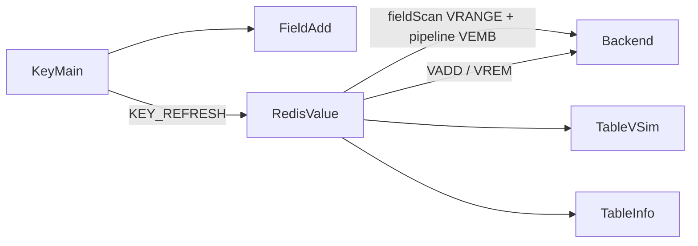

# 19. Redis Vector Set 类型支持

> **实现状态**：19.1 ✅；19.2 attrs + VINFO ✅；19.3 待开工（复核见 §九）  
> **关联 backlog**：`docs/zh/changelog/future.md`  
> **对标实现**：`plans/18_array-type-support.md`；前端管线对齐 Hash/Set（`key`/`value` 行）  
> **竞品信号**：Redis Insight 3.6；见 `plans/20260809_rdm-tools-recent-changelogs.md`  
> **造数脚本**：[`test/serialization/VectorSetSeed.py`](../test/serialization/VectorSetSeed.py)（`test:vset:*`，Redis ≥ 8.4）  
> **关键代码（预期）**：`util.rs`、`client_trait.rs`、`model.rs`、`api.rs`、`redis_cli_format.rs`；`redis-display.ts`、`RedisValue/*`、`FieldAdd.vue`、`helpers.ts`、`locales/cmd/index.ts`（commandFlags）

> 目标：支持原生 **Vector Set**（`TYPE`=`vectorset`）：浏览 / 增删改 / attrs / VINFO / **VSIM**。不做嵌入生成、不做 FT.*、不做无 `VRANGE` 降级。

---

## 一、决策摘要（已钉死）

| 项                                                 | 结论                                                                                                                                                                 |
| -------------------------------------------------- | -------------------------------------------------------------------------------------------------------------------------------------------------------------------- |
| 版本                                               | **Redis ≥ 8.4**（硬依赖 `VRANGE`）；旧服走现有命令错误                                                                                                               |
| 能力探测                                           | 不做                                                                                                                                                                 |
| Tag                                                | **`V`** / `VECTORSET` / `success`                                                                                                                                    |
| redis-rs                                           | feature **`vector-sets`**：VADD/VEMB/VCARD/VDIM/VREM 走库；VRANGE/VISMEMBER 无封装时 `cmd`（VRANGE 回复直接 `Vec<Vec<u8>>`）；`ValueType::VectorSet` 直接 match      |
| 行 IPC                                             | **`RedisVectorItem { key, value, attrs? }`**：`key`=元素（wire 同 Hash field），`value`=向量展示串（JSON，非 wire）；**UI 文案**用「元素 / 向量」（勿用「键 / 值」） |
| 续页游标                                           | 复用 **`ScanCursor.stream_cursor`**：存上一页最后元素的 **wire 串**；首页空；拼 VRANGE 时 `parse_bytes` 后前缀 `(`                                                   |
| finished                                           | `本页条数 < count` → finished（不必 Array 式 count+1 peek）                                                                                                          |
| 向量写入 IPC                                       | **`vector: Vec<f64>`**（Add/Set）；前端只做格式解析；**空/零不拦**，走 Redis VADD 原错；元素名 `field_key` + wire                                                    |
| `supportsFieldServerScan`                          | **含 `vectorset`**（仅为打开精确 `exact`；无服务端 MATCH，同 Array）                                                                                                 |
| `supportsFieldRowRefresh`                          | **19.1/19.2 不含**；保存后整表 `refreshKey`（不扩 `RedisFieldValue`）                                                                                                |
| `KEY_TYPE_TO_GROUP`                                | **`vectorset: 'vector_set'`**（对齐 `locales/cmd` 已有 group）                                                                                                       |
| VADD 返回值                                        | **新元素→1，已存在 upsert→0**；二者都算成功，禁止把 0 当失败                                                                                                         |
| commandFlags                                       | **19.1 起手工合并全部 V\***（读=`readonly`，写=`write`）；否则只读终端连 VRANGE 也被拦                                                                               |
| 相似度                                             | 独立弹窗；不进 fieldScan MATCH                                                                                                                                       |
| 嵌入 / FP32 / REDUCE / VLINKS / VRANDMEMBER 主浏览 | 不做或延后                                                                                                                                                           |

---

## 二、类型语义与命令

`TYPE` → `vectorset`。插入 **L2 归一化** + 可选量化；可选 JSON attrs（FILTER **仅顶层**字段）。

| 维度 | 命令 / 行为                                                                            |
| ---- | -------------------------------------------------------------------------------------- |
| 浏览 | `VRANGE key start end [count]`（**裸 count**，无 COUNT 关键字）                        |
| 精确 | `VISMEMBER` + `VEMB` [+ `VGETATTR`]                                                    |
| 写入 | `VADD … VALUES dim f… element [Q8\|NOQUANT\|BIN] [SETATTR …]`（选项在 **element 后**） |
| 删除 | `VREM`；删光通常掉键                                                                   |
| 长度 | `VCARD` → `FieldScanResult.length`；`VDIM` → **`vector_dim`**（勿用 `logical_length`） |
| 特有 | `VSIM` / `VINFO`                                                                       |



### 2.1 阶段归属

| 命令                                                   | 阶段 |
| ------------------------------------------------------ | ---- |
| VADD / VREM / VEMB / VCARD / VDIM / VISMEMBER / VRANGE | 19.1 |
| VGETATTR / VSETATTR（`""` 删 attrs）/ VINFO            | 19.2 |
| VSIM                                                   | 19.3 |
| VLINKS / VEMB RAW / FP32 / REDUCE / 量化细调 UI        | 延后 |

---

## 三、浏览（VRANGE）— 实现契约

```text
VRANGE key start end [count]     # count 为裸整数
```

1. 首页：`start=-`，`end=+`，`count=batch`；`stream_cursor=""`
2. 续页：解码 `stream_cursor` → 元素原始字节；`start = b"(" + bytes`（**一个** RESP bulk）；`end=+`
3. 页内 pipeline：`VEMB`（必选）→ 填 `value`；**attrs 不随 VRANGE**（打开 FieldSet 时 `VGETATTR`）
4. 精确：`field_scan_0_get` 在 exact 时返回 `None`，`field_scan_0_exact`：`VISMEMBER`→`VEMB`
5. 非精确 pattern：**仅前端本地过滤元素名**（`key`）；不按向量浮点过滤；attrs 若需过滤放 19.2 再定
6. `finished = (page.len() < count)`；若有数据则 `stream_cursor = 最后一行.key`（wire）

**VEMB 解析**：RESP2 为 bulk string 浮点数组 → 拼 JSON 数组写入 `value`。单行 `VEMB` 失败：该行 `value="-"`（或空），**不**整页失败（避免一坏行拖死浏览）。

---

## 四、IPC / UI 契约（防前端管线踩坑）

### 4.1 行模型（对齐 `ValueTableRow`）

```rust
// 字段名必须用 key/value，勿用 element/vector——否则 fieldDel / 过滤 / FieldSet 全空
RedisVectorItem {
  key: String,    // 元素名，format_bytes(..., bytes_format) → 通常 base64 wire
  value: String,  // 向量展示：JSON 如 "[0.1,0.2]"；高维由前端截断预览
  attrs: Option<String>, // 19.2
}
```

`fieldDel`：与 Hash 一样用 **`field_key = row.key`**（`field_del0` 走 `parse_bytes` + `VREM`）。  
前端现有 `fieldDel` 已传 `fieldKey: row.key`，vectorset **不要**误用 `fieldValue`（那是向量 JSON）。

### 4.2 写入

| 操作      | 映射                                                                                   |
| --------- | -------------------------------------------------------------------------------------- |
| FieldAdd  | `field_key`=元素 wire；`vector: number[]`；可选首插量化（19.2）；可选 SETATTR（19.2）  |
| FieldSet  | 元素只读（`field_key`）；`vector: number[]`；改 attrs → `VSETATTR`（19.2，可扩薄 IPC） |
| VADD 结果 | 忽略 0/1 差异，不报「未添加」                                                          |

### 4.3 helpers / 展示（必改清单）

- `supportsTableView` / `supportsFieldServerScan` **加** `vectorset`
- `supportsFieldRowRefresh`：**不加**
- `shouldFieldScanAuto`：随 serverScan 自动续页
- `KEY_TYPE_TO_GROUP.vectorset = 'vector_set'`
- `mergeFieldScanPage`：`includeMeta` 时合并 **`vectorDim`**
- Header：`textVectorDim` + i18n（对标 `textArLen`）
- 精确 tip：`fieldExactSearchVectorSet`（中英）
- 本地过滤 / JSON 视图：`tableDisplayList`、`showValue`、`fieldScanValueForJsonView` 分支
- `commandFlags`：合并 `VADD VREM VEMB VCARD VDIM VISMEMBER VRANGE VGETATTR VSETATTR VINFO VSIM VLINKS VRANDMEMBER` 等（读/写标志按官方；与 `generate-readonly-flags.mjs` 注释一致「手工合并」）

### 4.4 易错业务规则

- 零向量禁止（前端预检）
- 维度锁定：`VDIM` 预检
- 量化锁定：仅空键首条
- `VALUES` 关键字始终输出（含 dim=1）
- upsert 不带 SETATTR 时 attrs 通常保留（种子 `upsert` 可验）

### 4.5 VSIM（19.3）

ELE / VALUES；COUNT；WITHSCORES 默认开；可选 WITHATTRIBS / EPSILON / EF / FILTER。  
RESP2 双 WITH*：**ele, score, attribs**。分数 1=同向，0=反向。

### 4.6 复制命令

- 行：`field_key` 定位 → 服务端 `VEMB`[+attrs] → `VADD … VALUES …`（注明近似）
- 键：受控 `VRANGE` 批量；**上限写死**（建议默认最多 1000 条或跟现有导出设置），超限截断 + warn；`export_cmd` 同路径

---

## 五、分阶段验收

环境：Redis ≥ 8.4。  
`python test/serialization/VectorSetSeed.py [host] [port] [password]`

### 19.1 基础读写 + 浏览

**做：** 类型识别；VRANGE+VEMB；VADD/VREM；精确；VCARD+vector_dim；Tag/表格/FieldAdd/FieldSet；commandFlags；上述 helpers/i18n。

| 种子                      | 验收点                        |
| ------------------------- | ----------------------------- |
| `points`                  | 打开表格、Tag=`V`             |
| `page`                    | 续页 80 条                    |
| `lex-order`               | exclusive 游标语义            |
| `exact`                   | 精确 `find-me`                |
| `highdim`                 | 64 维截断                     |
| `unicode` / `binary-elem` | UTF-8 与非 UTF-8 元素 wire    |
| `dim1`                    | VALUES 1                      |
| `single` / `upsert`       | 改向量；upsert 成功（返回 0） |
| `ttl-1h`                  | TTL 展示                      |
| GUI                       | 零向量 / 维度不一致可读错误   |
| 只读模式终端              | VRANGE/VEMB 可执行；VADD 不可 |

### 19.2 attrs + VINFO

`attrs-mixed` / `movies`；`quant-q8` vs `quant-noq`；清空 attrs。

### 19.3 VSIM

`points` ELE；`movies` FILTER `.year >= 2000`；「以此再搜」。

---

## 六、改动文件清单

### 后端

1. 前端 `src/utils/vector.ts` 多格式→`number[]`；后端直调 `vadd`（不预检空/零）
2. `client_trait.rs`：field_scan（含 exact）/ add / set / del / length+dim / key&field as_command；**不**做 field_get（或直接 Unsupported）
3. `model.rs`：`RedisVectorItem`；`vector_dim`；`RedisFieldAdd/Set.vector`；`RedisVSim*` / `RedisVInfoItem`
4. `api.rs` + Specta：`v_sim` / `v_info`
5. `redis_cli_format.rs`：`format_vadd_command`

### 前端

1. `redis-display.ts`
2. `helpers.ts`（§4.3 全表）
3. `RedisValue/index.vue` + `FieldSet` + `FieldAdd`
4. `TableVSim.vue` / `TableInfo.vue`（VINFO 与 ARINFO/OBJECT 共用）（分阶段）
5. i18n；`locales/cmd/index.ts` **commandFlags**

### 测试

- `VectorSetSeed.py`（已含 binary-elem / upsert 返回值注释）

---

## 七、风险

1. 页内 N×VEMB 成本；batch 别过大
2. VEMB 近似 → 展示/导出偏差
3. FILTER 静默跳过缺字段/坏 JSON
4. DEL 大 vectorset 可能延迟尖峰（官方 troubleshooting）
5. REDUCE（延后）复制矩阵不复制到 replica
6. 与 RedisSearch 向量字段无关

---

## 八、与 Array 对照

|          | Array                                    | Vector Set                                |
| -------- | ---------------------------------------- | ----------------------------------------- |
| 扫描     | ARSCAN + LIMIT 关键字；`now_cursor` 索引 | VRANGE 裸 count；**`stream_cursor` wire** |
| 行       | `RedisListItem` index/value              | **`RedisVectorItem` key/value/attrs**     |
| 双度量   | length + logical_length                  | length + **vector_dim**                   |
| 精确     | ARGET                                    | VISMEMBER+VEMB                            |
| 写入返回 | ARSET 等                                 | **VADD upsert→0 仍成功**                  |
| Tag      | A warning                                | V success                                 |

---

## 九、复核记录

### 9.1 第一轮（语义 / 官方命令）

已纠正：VRANGE 裸 count；独立 `vector_dim`；无 MATCH；零向量/量化/dim=1；SETATTR 空串删除；VSIM RESP2 顺序；VADD 量化在 element 后；不做无 VRANGE 降级。

### 9.2 第二轮（对照仓库管线，2026-08-09）

对照 `ScanCursor`、`supports*`、`fieldDel`/`FieldAdd` wire、`commandFlags`、`ValueTableRow`、本地 Redis **实测 VADD upsert→0**。

| 严重度  | 问题                                                    | 方案落点                                       |
| ------- | ------------------------------------------------------- | ---------------------------------------------- |
| blocker | 续页游标未映射 `ScanCursor`                             | §一 / §三 → **`stream_cursor` + wire**         |
| blocker | `supportsFieldServerScan` 易被理解成 false 导致精确失效 | §一：必须 **包含** vectorset                   |
| blocker | 向量 IPC / wire 未钉死                                  | §一：`vector: Vec<f64>`；元素 `field_key` wire |
| blocker | 行字段 `element/vector` 与前端 `key/value` 不兼容       | §4.1：改用 **key/value/attrs**                 |
| blocker | `field_get`/`RedisFieldValue` 装不下                    | §一：19.x **不做** row refresh                 |
| blocker | **VADD upsert 返回 0** 若当失败会误报                   | §一 / §4.2；种子注释                           |
| should  | FieldSet 跳过 wire；attrs 模型                          | §4.2                                           |
| should  | 键/行复制 LIMIT；export 同路径                          | §4.6                                           |
| should  | 精确 tip / 本地过滤 / JSON 视图 / Header dim            | §4.3                                           |
| should  | **commandFlags 缺 V\***                                 | §一 / §4.3                                     |
| should  | `KEY_TYPE_TO_GROUP` → `vector_set`                      | §一                                            |
| should  | VEMB 解析与单行失败策略                                 | §三                                            |
| should  | exact / `to_key_type` 路径写清                          | §三 / §六                                      |
| nit     | 验收表补 dim1/lex-order/ttl/binary-elem                 | §五                                            |
| nit     | 键级 rename/ttl/del/收藏/Cluster **无需**类型分支       | 确认不改                                       |

### 9.3 第三轮自检（本轮写完后再扫）

再扫一遍后，**未发现新的 blocker**。剩余仅为实现时按清单改代码，而非方案空洞：

- Active-Active 云不支持 vectorset：产品可不提示，失败走服务端错误即可
- `FieldScanValue` 联合体是否扩字段：扫描结果可像 Array 一样 **直接 `serde_json::to_value(Vec<RedisVectorItem>)`**，不必塞进 `FieldScanValue.hash/set/zset`
- 监控/慢日志/内存分析页：无类型白名单依赖则不动
- 种子 `lex-order` 使用 `hash(name)`：CPython 盐化导致每次向量不同——**仅影响 VSIM 稳定性，不影响 VRANGE 字典序**；若要对齐 VSIM 可再改固定向量（非方案缺陷）

### 9.4 有意不做

无 VRANGE 降级；嵌入；FP32/REDUCE/VLINKS；FILTER 可视化构造器；Insight 样例集；`field_get` 单行刷新。
