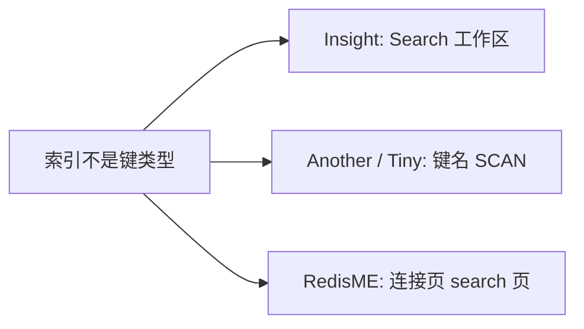

# 33. RedisSearch 支持评估

> **实现状态**：33.1 / 33.2 / 33.3 已实现（搜索页：索引列表、schema、FT.SEARCH、简单建删）  
> **关联 backlog**：`docs/zh/changelog/future.md`（RedisSearch 的支持）  
> **对标**：Redis Insight Search 工作区。Another / Tiny / Redisee 没有 `FT.*` 界面  
> **不要照搬**：[`30_timeseries-support.md`](./30_timeseries-support.md) 的键类型接入。索引不是 `SCAN` 可见的 `TYPE`  
> **关键代码（预期）**：[`TabMain.vue`](../../src/views/TabMain.vue)、新建 `src/views/tab/RedisSearch.vue`；后端 `redis::cmd("FT.…")`；[`locales/cmd/index.ts`](../../src/locales/cmd/index.ts) 的 `commandFlags`

> 目标：连接页增加「搜索」页，先只读看索引、再 `FT.SEARCH` 查文档。文档仍是 Hash / JSON，编辑走现有 value 页。建删索引后置。不做 Insight 的查询库、聚合图表和向量索引向导。

---

## 一、竞品结论

| 产品              | 是否支持 RedisSearch                      | 怎么做                                                                                       | 对 RedisME 的启示                                           |
| ----------------- | ----------------------------------------- | -------------------------------------------------------------------------------------------- | ----------------------------------------------------------- |
| **Redis Insight** | **有**，一等公民                          | 独立 Search 工作区：索引列表、`FT.INFO`、schema 感知查询、Query Library、建索引向导          | **对标目标**。列表与查询先做，建删是 33.3；查询库和向导不做 |
| **Another RDM**   | **无**                                    | changelog 里的 Search 是键名 / 字段过滤，不是 `FT.SEARCH`                                    | 不参考                                                      |
| **Tiny RDM**      | **无**                                    | 键列表 SCAN + 本地筛选（[过滤文档](https://redis.tinycraft.cc/guide/filter/)）               | 不参考                                                      |
| **Redisee**       | 公开资料未见 `FT.*` 界面                  | —                                                                                            | 不参考                                                      |
| **本仓库终端**    | 命令帮助已有 `FT.*`，只读模式几乎放行不了 | [`commandFlags`](../../src/locales/cmd/index.ts) 里搜索命令只有 `FT.ALIASLIST`（`readonly`） | 33.1 补其余 `FT.*`                                          |



### 1.1 Redis Insight（可借鉴的只有四条命令）

官方说明：<https://redis.io/docs/latest/develop/tools/insight/search-workspace/>  
后端：[`redisearch.service.ts`](https://github.com/redis/RedisInsight/blob/main/redisinsight/api/src/modules/browser/redisearch/redisearch.service.ts)

| 能力   | 实现                                                                                                     |
| ------ | -------------------------------------------------------------------------------------------------------- |
| 列表   | 每个 master `FT._LIST`，名字去重（集群上索引按分片各有一份）                                             |
| 定义   | `FT.INFO`，扁平键值对解析成 schema / 文档数 / 进度                                                       |
| 查询   | `FT.SEARCH index query NOCONTENT LIMIT offset limit`，用来当键浏览器；默认查询 `*`                       |
| 建索引 | `FT.CREATE`，集群对每个分片各发一次，忽略 `already exists` / `MOVED`                                     |
| 删索引 | `FT.DROPINDEX`（Insight 不带 `DD`，文档保留）                                                            |
| 上限   | `FT.CONFIG GET MAXSEARCHRESULTS`，失败则忽略（Redis 8 上该命令可能已不存在）                             |
| 键详情 | Hash/JSON 上「Make searchable」「View index」，按前缀判断是否已进某个索引                                |
| 护城河 | schema 自动补全、Query Library、`FT.AGGREGATE` 图表、`FT.PROFILE` / `EXPLAIN`、向量索引向导（HNSW/FLAT） |

已知坑：索引详情曾漏显示 `WITHSUFFIXTRIE`（[issue #6087](https://github.com/redis/RedisInsight/issues/6087)）。解析 `FT.INFO` 时未知字段必须原样留下，不能只认写死的选项列表。

### 1.2 其他桌面客户端

Another、Tiny 的「搜索」都是 `SCAN` 匹配键名。没有索引列表，也没有查询语法。RedisME 的键树过滤已经覆盖这条路径，不必再做一层。

---

## 二、决策摘要

| 项             | 结论                                                                                                                                                                                                                                      |
| -------------- | ----------------------------------------------------------------------------------------------------------------------------------------------------------------------------------------------------------------------------------------- |
| 形态           | 连接页新 Tab `search`，与终端、慢日志同级。极简模式隐藏，与 memory / slow 一致（[`TabMain.vue`](../../src/views/TabMain.vue)）                                                                                                            |
| 不是键类型     | **不**进 `KEY_TYPE_LIST` / `toKeyTypeLabel` / `SCAN TYPE`。`SCAN` 看不到索引名                                                                                                                                                            |
| 文档           | 仍是 Hash / JSON。点结果键切到 value 页。`chooseKey` 在 [`KeyMain.vue`](../../src/views/KeyMain.vue)，和搜索页是兄弟，调不到。搜索页自己写 `share.redisKey`、`share.tabName='value'`，再 `bus.emit(KEY_REFRESH)`。UTF-8 键名 `bytes` 留空 |
| 能力探测       | 不做 `MODULE LIST`。`unknown command` 收成「未启用 RedisSearch」                                                                                                                                                                          |
| 命令通道       | `redis::cmd("FT.…")`。redis-rs 无 Search 高层 API                                                                                                                                                                                         |
| 列表           | 每个 master `FT._LIST`，去重                                                                                                                                                                                                              |
| 定义           | `FT.INFO`；未知键值原样展示                                                                                                                                                                                                               |
| 查询           | `FT.SEARCH` + 始终带 `LIMIT`。默认查询 `*`。禁止无 LIMIT 全量                                                                                                                                                                             |
| 集群写入       | `FT.CREATE` 每个 master 各一次，忽略 `already exists` / `MOVED`。`FT.SEARCH` / `FT.DROPINDEX` 打到一个 master（协调节点汇总）                                                                                                             |
| 删除           | `FT.DROPINDEX` **不带** `DD`，文档保留。二次确认                                                                                                                                                                                          |
| 建索引表单     | 只覆盖 `ON HASH\|JSON`、`PREFIX`、字段名 + `TEXT\|TAG\|NUMERIC\|GEO`                                                                                                                                                                      |
| `FT.CONFIG`    | `MAXSEARCHRESULTS` 读失败就忽略                                                                                                                                                                                                           |
| `commandFlags` | **33.1 起**手工合并其余 `FT.*`（读=`readonly`，写=`write`）。`FT.ALIASLIST` 已是 `readonly`，只读终端仍会拒绝 `FT.SEARCH` / `FT.INFO`                                                                                                     |
| 延后           | 见 §九                                                                                                                                                                                                                                    |

---

## 三、RedisME 现状缺口

- 连接页 Tab 只有 info / value / terminal / memory / slow / monitor / pubsub / chart，没有搜索页。
- 命令帮助已收录 `FT.*`（[`src/locales/cmd/en.ts`](../../src/locales/cmd/en.ts)，group=`search`），含 `FT._LIST`、`FT.SEARCH`、`FT.INFO`、`FT.CREATE`、`FT.DROPINDEX`、`FT.AGGREGATE`、`FT.HYBRID` 等。
- 只读判断在 [`isReadonlyCommand`](../../src/locales/cmd/index.ts)：`commandFlags` 没有该项就直接返回 false，走不到灰名单。`FT.ALIASLIST` 已在 `commandFlags`（`readonly`）里，灰名单里也有一份。其余 `FT.*` 两边都没有，只读终端会拒绝。
- 集群发命令已有节点路由：[`me_cluster.rs`](../../src-tauri/src/client/me_cluster.rs) 的 `execute_command` 可按 `node` 打到指定节点，也可 `auto_broadcast`。列表 / 建索引要「每个 master 各发一次再合并名字」，单次 `execute_command` 不够，要单独 IPC。单机 [`node_list`](../../src-tauri/src/client/me_single.rs) 返回空数组，不能靠它判断「有没有节点」。
- 打开键：`chooseKey` 是 KeyMain 内部函数。它做的事是写入 `share.redisKey`、把 `share.tabName` 设为 `value`、`bus.emit(KEY_REFRESH)`。左侧树滚动是另一条注入：`connUi.scrollKeyToTree`。

---

## 四、命令契约

索引不是键。文档是匹配 `PREFIX` 的 Hash 或 JSON。索引属于当前逻辑库：命令打在连接已经 `SELECT` 的库上（`share.conn.db`），切换库后重新拉列表。Redis 8 起 Query Engine 常随服务端内置；旧实例需要 Redis Stack / 模块。未安装时第一条 `FT._LIST` 即报 `unknown command`。

| 阶段 | 命令                                       | 行为                              |
| ---- | ------------------------------------------ | --------------------------------- |
| 33.1 | `FT._LIST`                                 | 每个 master 一次，索引名去重      |
| 33.1 | `FT.INFO index`                            | 列表列 + schema 表                |
| 33.2 | `FT.SEARCH index query LIMIT offset count` | 可选 `WITHSCORES`；默认带文档字段 |
| 33.3 | `FT.CREATE`                                | 集群每个 master 一次              |
| 33.3 | `FT.DROPINDEX index`                       | 不带 `DD`                         |

`FT.SEARCH` 默认 `LIMIT 0 10`。界面必须显式传入 `LIMIT`，页大小跟现有表格批量，不要一次拉全库。

### 4.1 `FT.INFO` 要取出的字段

回复是扁平键值数组，`attributes` / `index_definition` 再嵌一层。

列表列：

- 名称
- `index_definition.key_type`：`HASH` 或 `JSON`
- `index_definition.prefixes`
- `num_docs`
- `indexing` / `percent_indexed`（索引进度）

schema 表每行：

- `identifier`
- `attribute`
- `type`（`TEXT` / `TAG` / `NUMERIC` / `GEO` / `VECTOR` / `GEOSHAPE` 等，不认识也显示原文）
- 选项原样拼接（`SORTABLE`、`NOINDEX`、`WITHSUFFIXTRIE`、`SEPARATOR`、`WEIGHT`、向量的算法 / 维度 / 距离）。未识别的键值对进「原始」区，避免再漏字段

### 4.2 `FT.SEARCH` 回复顺序（RESP2）

按官方顺序解析，对不上就整页报错，不要猜。

| 选项           | 每个文档的顺序                                         |
| -------------- | ------------------------------------------------------ |
| 默认（带字段） | `key`，然后 `[field, value, …]`                        |
| `WITHSCORES`   | `key`，`score`，然后字段数组                           |
| `NOCONTENT`    | 只有 `key`（本计划查询页不用，Insight 用它当键浏览器） |

第一项始终是总命中数。总命中数大于本页时用 `LIMIT` 翻页，游标是 offset，不是 `SCAN` cursor。

33.2 固定一种形状：默认带字段，勾选才加 `WITHSCORES`。不要在首期叠加 `WITHPAYLOADS`、`RETURN`、`FILTER`、`GEOFILTER`、`PARAMS`、`DIALECT`。这些是 `FT.SEARCH` 的独立参数，写进查询框会变成 query 表达式。数值、标签条件可以用查询语法（如 `@price:[1 10]`）。其余要去终端写完整命令。

连接默认 RESP2，只有 `meta.protocol=resp3` 才升到 RESP3。上面的扁平顺序只适用于 RESP2。RESP3 下 `FT.INFO` / `FT.SEARCH` 是 map，解析要看当前连接协议。

### 4.3 集群

```text
单机:  当前连接发一次。node_list 是空的，不要遍历它
列表:  每个 master  FT._LIST          → 名字并集
定义:  一个 master  FT.INFO
查询:  一个 master  FT.SEARCH         → 协调节点汇总
创建:  每个 master  FT.CREATE         → 忽略 already exists / MOVED
删除:  一个 master  FT.DROPINDEX      → 不带 DD
```

漏发某个分片的 `FT.CREATE`，该分片没有索引，查询结果会偏少。这是实现时要测的点。

### 4.4 `commandFlags`（33.1，与界面无关也要补）

对齐 TimeSeries / Vector Set 的手工合并。读命令带 `readonly`，写命令带 `write`。

只读：`FT._LIST`、`FT.INFO`、`FT.SEARCH`、`FT.AGGREGATE`、`FT.PROFILE`、`FT.EXPLAIN`、`FT.EXPLAINCLI`、`FT.SPELLCHECK`、`FT.TAGVALS`、`FT.HYBRID`、`FT.SUGGET`、`FT.SUGLEN`、`FT.CURSOR READ`、`FT.DICTDUMP`、`FT.SYNDUMP`、`FT.ALIASLIST`、`FT.CONFIG GET`、`FT.CONFIG HELP`。

只写：`FT.CREATE`、`FT.DROPINDEX`、`FT.ALTER`、`FT.ALIASADD`、`FT.ALIASDEL`、`FT.ALIASUPDATE`、`FT.CURSOR DEL`、`FT.SUGADD`、`FT.SUGDEL`、`FT.SYNUPDATE`、`FT.DICTADD`、`FT.DICTDEL`、`FT.CONFIG SET`。

`FT.ALIASLIST` 已经在 `commandFlags` 和灰名单里，补其他命令时保持它的 `readonly` 不变。

---

## 五、搜索页结构

一页先是索引表。点某一行的「查询」进入该索引的搜索页，点「查看」才打开字段弹框。不做成 Insight 那种左右分栏。没装模块时整页只留一句「未启用 RedisSearch」。

```text
索引列表（工具栏左右分开，和慢查询等页一样）
┌ [索引样例]                        [筛选____] 🔍 ┐
│ 名称 │ 前缀 │ Docs │ Records │ Terms │ Fields │ 查询 │ … │
└────────────────────────────────────────────────┘

查询页（点「查询」进入）
┌ 返回  索引名  [ *________ ] 分数  🔍 ┐
│ 结果：键 │ 分数 │ 字段…                │
│       点键 ──────────────► value 页   │
└──────────────────────────────────────┘

查看弹框
┌ 字段 | 其他 ┐
│ identifier │ attribute │ type │
└────────────┘
```

- 列表工具栏右侧是固定宽度筛选框和查询图标，布局与慢查询等页一致。通用新建先不做：`FT.CREATE` 选项太多，简单弹框盖不住。左上角「索引样例」只提供 Redis Insight 的两套固定数据（`idx:bikes_vss` / `idx:movies_vss`）。同名索引已在当前库时不写键、不重建，只提示。只读连接不显示这个按钮。筛选按名称、前缀在已加载结果里模糊匹配；查询图标重新拉取列表。
- 索引表列：名称、前缀、Docs、Records、Terms、Fields，以及操作列。不再单独显示 HASH/JSON。Fields 可点开 schema。Records / Terms 来自 `FT.INFO` 的 `num_records` / `num_terms`。操作列与键值列表同宽（80）：查询、信息、扩展；扩展里是删除索引。信息打开终端 JSON 原文。
- 「查看」弹框放 schema。索引信息弹框展示 `FT.INFO` 的终端 JSON 原文。
- 查询页绑在点进来的那个索引上。点结果里的键离开本页，切到 value 页。搜索页重复 `chooseKey` 的三步（`share.redisKey`、`tabName`、`KEY_REFRESH`），不把 `chooseKey` 抽成公共函数。文档编辑不在搜索页里做。左侧树要跟着定位时再调 `connUi.scrollKeyToTree`。

---

## 六、分阶段验收

每阶段：**实现 → 手工验收 → 单独 commit**（一行标题，无 body）。完成后勾 `future.md`。环境：带 Query Engine 的 Redis 8，或装了 RediSearch 的 Redis Stack。另备一个没装模块的实例看报错文案。

### 33.1 索引只读

**做：**

- [`TabMain.vue`](../../src/views/TabMain.vue) 增加 `search`（极简模式不显示）
- 索引表列：名称、前缀、Docs、Records、Terms、Fields。不再单独显示 HASH/JSON。Fields 可点开 schema。操作列与键值列表同宽（80）：查询、信息、扩展；扩展里是删除索引。信息打开终端 JSON 原文
- 未装模块：文案「未启用 RedisSearch」，不要裸 `unknown command`
- 补全 §4.4 的 `commandFlags`
- 表格若走 MeTable，`exportRows` 与列同步

**验收：**

- 有索引的实例能列出，schema 与 `FT.INFO` 一致（含 `WITHSUFFIXTRIE` 这类选项）
- 无模块：页面说明未启用，连接其他 Tab 不受影响
- 只读终端可以执行 `FT.INFO` / `FT.SEARCH` / `FT._LIST`，仍拒绝 `FT.CREATE` / `FT.DROPINDEX`
- 集群：多 master 的 `FT._LIST` 去重后不重复

### 33.2 查询

**做：**

- 查询框，默认 `*`
- `FT.SEARCH` + `LIMIT` 分页；可选 `WITHSCORES`
- 结果表：键、分数（若开启）、字段。字段多时单元格截断，导出与列一致
- 点键：切到 value 页并打开该键（见 §五，不直接调用 `chooseKey`）
- 导出设上限，超限截断并提示

**验收：**

- `*` 与一条带 `@field:` 的查询能翻页，本页条数不超过 `LIMIT`
- 点结果键能在 value 页看到原来的 Hash 或 JSON
- 非法查询把 Redis 错误原文展示出来

### 33.3 建删

**做：**

- 新建：索引名、`ON HASH|JSON`、一个或多个前缀、字段名 + `TEXT|TAG|NUMERIC|GEO`
- 集群：每个 master 发 `FT.CREATE`
- 删除：二次确认，命令为 `FT.DROPINDEX`，不附带 `DD`

**验收：**

- 建完刷新列表能看到；用 33.2 能查到匹配前缀的文档
- 删除后索引消失，文档键还在
- 重复创建：已存在时提示，不把其他分片打坏

---

## 七、改动清单（汇总，实施时用）

### 后端

1. 新 IPC：`search_index_list`（各 master `FT._LIST` + 每个索引 `FT.INFO`）、`search_query`（`FT.SEARCH`）、`search_index_drop`、`search_sample_load`（固定样例，不是通用 `FT.CREATE`）。`search_index_create` 先不做，等 `FT.CREATE` 的选项怎么呈现想清楚再加
2. 仅集群用 `node_list` 挑 master，不要对从节点发 `FT.CREATE`。单机 `node_list` 为空，对当前连接发一次
3. `FT.INFO` / `FT.SEARCH` 按 §4 解析；解析失败整页错误
4. `unknown command` 映射成固定错误码或文案，供前端空状态

### 前端

1. [`TabMain.vue`](../../src/views/TabMain.vue)：`search` 页，`v-if="!minimalMode"`，`lazy`
2. `src/views/tab/RedisSearch.vue`：下拉选索引 + 查询结果。schema 和其余 `FT.INFO` 在详情弹框
3. i18n（中英）
4. [`locales/cmd/index.ts`](../../src/locales/cmd/index.ts)：§4.4
5. 结果行打开键：`share.redisKey`（UTF-8 则 `bytes` 为空）/ `tabName='value'` / `KEY_REFRESH`。可选 `connUi.scrollKeyToTree`

---

## 八、风险

- `FT.INFO` 的 attributes、`FT.SEARCH` 在 `WITHSCORES` 下的交错数组，解析必须按官方顺序。失败整页报错。RESP3 是 map，不能套用 RESP2 下标。
- 大索引必须 `LIMIT`。导出设上限。
- 集群漏发某个 master 的 `FT.CREATE`，查询结果偏少。
- `FT.CONFIG GET MAXSEARCHRESULTS` 在 Redis 8 可能不存在，失败忽略，不要挡住列表。
- `FT.DROPINDEX` 若误加 `DD` 会删掉文档键。默认绝不带 `DD`。
- 向量字段会出现在 schema 里（只展示）。创建表单不做 `VECTOR`，避免半套 HNSW 参数。

---

## 九、不做

Insight 里以下能力不进 33.1–33.3：

- schema 自动补全、Query Library（查询另存）
- `FT.AGGREGATE` 图表、`FT.PROFILE`、`FT.EXPLAIN` / `FT.EXPLAINCLI`
- 向量索引向导（算法、维度、距离、`HNSW` / `FLAT`）
- 键详情上的「Make searchable」「View index」
- `FT.SUG*`、`FT.SPELLCHECK`、`FT.ALTER` 加字段、`FT.CURSOR`、同义词 / 词典
- 把 RedisSearch 当成新的键类型，或用 `FT.SEARCH` 替换左侧键树的 `SCAN`

与 Vector Set 的 `VSIM` 无关。向量集合仍走 [19 号计划](./19_vector-set-support.md)。

---

## 十、参考链接

- Search 工作区：<https://redis.io/docs/latest/develop/tools/insight/search-workspace/>
- `FT.SEARCH`：<https://redis.io/docs/latest/commands/ft.search/>
- `FT.CREATE`：<https://redis.io/docs/latest/commands/ft.create/>
- `FT.INFO`：<https://redis.io/docs/latest/commands/ft.info/>
- `FT.DROPINDEX`：<https://redis.io/docs/latest/commands/ft.dropindex/>
- Insight 后端：`redisinsight/api/src/modules/browser/redisearch/redisearch.service.ts`
- Insight 漏字段：<https://github.com/redis/RedisInsight/issues/6087>
